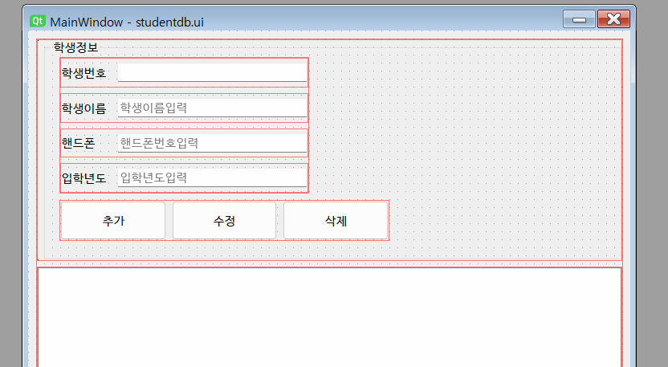

## 토이프로젝트
Python GUI - Oracle연동 프로그램

## GUI 프레임워크
- GUI 프레임워크 종류
    1. tkinter 
        - 파이썬에 내장되어있는 GUI 라이브러리, 중소형 프로그램 사용, 간단하게 사용 가능, 안 이쁨
    2. **PyQt** / Pyside 
        - C/C++에서 사용하는 GUI프레임워크 Qt를 파이썬에서 사용할 수 있게 만든 라이브러리, 현재 6버전 출시, 유료
        - PyQt의 사용라이선스 문제로 PySide 릴리즈, PyQt에서 PySide 변경하는데 번가로움 존재
        - 아주 이쁨, QtDesigner틀로 포토샵처럼 GUI 디자인 가능
        - Python GUI 중 가장 많이 사용
    3. Kivy
        - OpenGL(게임엔진용 3D 그래픽엔진)로 구현되는 GUI 프레임워크
        - 안드로이드, iOS 등 모바일용으로도 개발가능
        - 최신에 나온 기술이라 아직 불안정
    4. wxPython
        - Kivy처럼 멀티플랫폼 GUI 프레임워크
        - 무지 어려움

## PyQtS GUI 사용
- PyQt5 설치
    - pip install PuQt5
- QtDesigner 설치
    - https://build-system.fman.io/qt-designer-download 다운로드
    

### PyQt5 개발
1. PyQt 모듈 사용 윈앱 만들기
2. 윈도우 기본설정
3. PyQt 위젯 사용법(레이블, 버튼, ...)
4. 시그널(이벤트) 처리방법
5. QtDesigner로 화면 디자인 후 PyQt와 연동
    

#### Oracle 연동 GUI개발 시작
- 오라클 Python 연동 DB(스키마) 생성
    ```sql
    -- sys(sysdba)로 작업
    -- madang 스키마, 사용자 생성
    CREATE USER madang IDENTIFIED BY madang;

    -- 권한 설정
    GRANT CONNECT, resource TO madang;

    -- madang으로 사용 스키마 변경 (단축키 : Ctrl + 0)

    -- 테이블 Student 생성
    CREATE TABLE Students(
        std_id 		NUMBER 			PRIMARY KEY,
        std_name	varchar2(100) 	NOT NULL,
        std_mobile 	varchar2(15) 	NULL,
        std_regyear number(4,0)		NOT NULL
    );

    -- Student용 Sequence 생성
    CREATE SEQUENCE SEQ_STUDENT
        INCREMENT BY 1		-- 숫자를 1씩 증가
        START WITH 1;		-- 1부터 숫자가 증가

    COMMIT;
    -- 사용자를 madang으로 변경
    ```
- Student 테이블 생성, 더미데이터 추가
    ```sql
    -- madang 로그인
    -- 조회
    SELECT * FROM Students;

    -- 더미데이터 삽입
    INSERT INTO STUDENTS(std_id, std_name, std_mobile, std_regyear)  
    VALUES (SEQ_STUDENT.nextval, '홍길동', '010-1234-5678', 1997);
    INSERT INTO STUDENTS(std_id, std_name, std_mobile, std_regyear)  
    VALUES (SEQ_STUDENT.nextval, '홍길순', '010-1234-8765', 2000);

    COMMIT;
    ```
- Python 오라클 연동 테스트
    - 오라클 모듈
        - oracledb - Oracle 최신버전에 매칭
        - **cx_Oracle** - 구버전까지 잘 됨
    - VScode 콘솔(터미널)에서 `> pip install cx_Oracle`
    - [Microsoft C++ Build Tools](https://visualstudio.microsoft.com/ko/visual-cpp-build-tools/) 필요
        - Visual Studio Installer 실행
        - 개별 구성요서에서 아래 요소 선택
            - [x] MSVC v1XX - VS 20XX C++ x64/x86 빌드도구
            - [x] C++ CMake Tools for Window
            - [x] Windows 10 SDK(10.0.xxxxx)
        - 설치
    - 콘솔에서 `> pip install cx_Oracle`
    - 콘솔 오라클 연동 : [python](./)
        - DPI-1047 오류 발생
        - 64-bit Oracle Client Library가 OS에 설치되지 않았기 때문에 발생하는 현상
        - 아래 사이트에서 버전에 맞는 Oracle Client를 다운로드
        - https://www.oracle.com/kr/database/technologies/instant-client/winx64-64-downloads.html
        - 11g 다운로드
        - 압축해제(C:\Dev\Tool\instantclient_11_2), 시스템정보 Path 등록
        - 재부팅
    - 콘솔 테스트 결과
        
- QtDesigner로 화면 구성
    
- PyQt로 Oracle 연동 CRUD 구현
    - 조회 SELECT 구현
    - 삽입 INSERT 구현
    - 수정, 삭제 구현
    - 입력값 검증(Validation check) 로직
    - DML이 종료된 후 다시 데이터 로드 로직 추가
    - 데이터 삽입 후 라인에디트에 기존 입력값이 남아있는 것 제거
    

- 개발도중 문제
    - [x] 수정모드에서 추가를 눌러도 새로운 데이터 삽입
    - [x] 수정모드에서 추가를 한 뒤 학생번호가 라인에디트에 그대로 존재

- 개발완료 화면
    - 아이콘 변경 및 추가
    

### 데이터베이스 모델링
- 서점 데이터 모델링

