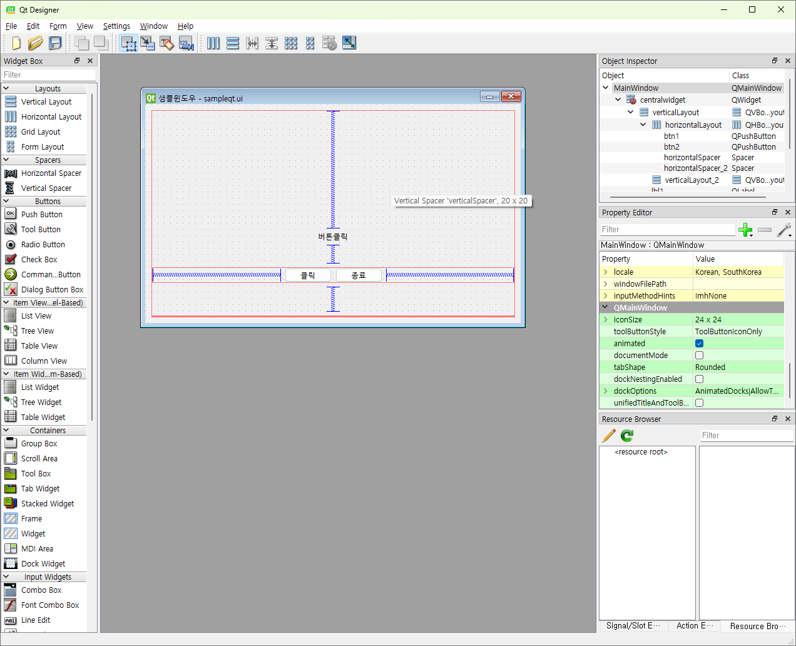

## 토이프로젝트
Python GUI - Oracle연동 프로그램

## GUI 프레임워크
- GUI 프레임워크 종류
    1. tkinter 
        - 파이썬에 내장되어있는 GUI 라이브러리, 중소형 프로그램 사용, 간단하게 사용 가능, 안 이쁨
    2. **PyQt** / Pyside 
        - C/C++에서 사용하는 GUI프레임워크 Qt를 파이썬에서 사용할 수 있게 만든 라이브러리, 현재 6버전 출시, 유료
        - PyQt의 사용라이선스 문제로 PySide 릴리즈, PyQt에서 PySide 변경하는데 번가로움 존재
        - 아주 이쁨, QtDesigner틀로 포토샵처럼 GUI 디자인 가능
        - Python GUI 중 가장 많이 사용
    3. Kivy
        - OpenGL(게임엔진용 3D 그래픽엔진)로 구현되는 GUI 프레임워크
        - 안드로이드, iOS 등 모바일용으로도 개발가능
        - 최신에 나온 기술이라 아직 불안정
    4. wxPython
        - Kivy처럼 멀티플랫폼 GUI 프레임워크
        - 무지 어려움

## PyQtS GUI 사용
- PyQt5 설치
    - pip install PuQt5
- QtDesigner 설치
    - https://build-system.fman.io/qt-designer-download 다운로드
    

### PyQt5 개발
1. PyQt 모듈 사용 윈앱 만들기
2. 윈도우 기본설정
3. PyQt 위젯 사용법(레이블, 버튼, ...)
4. 시그널(이벤트) 처리방법
5. QtDesigner로 화면 디자인 후 PyQt와 연동
    